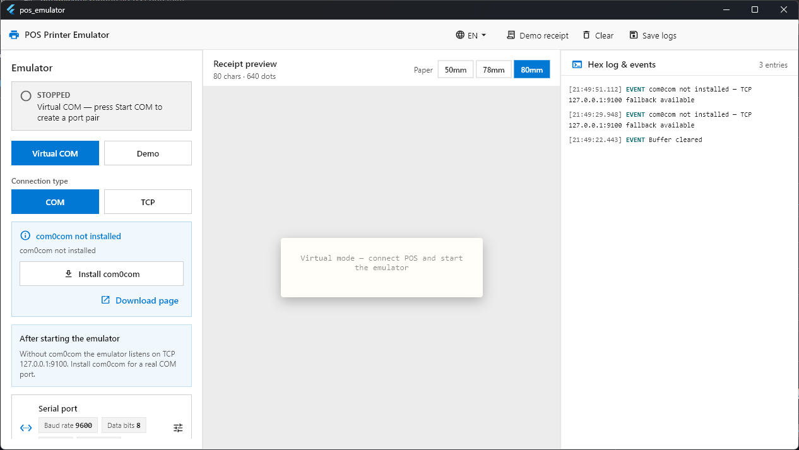

# Эмулятор POS-принтера

Windows-приложение: принимает ESC/POS от кассы или демо-потока и показывает чек на экране.



## Запуск

```powershell
cd c:\Work\pos_emulator
fvm install
fvm flutter pub get
fvm flutter run -d windows
```

Сборка: `fvm flutter build windows` → `build\windows\x64\runner\Release\pos_emulator.exe`

**Нужно:** Windows 10/11, Flutter 3.44.0 (FVM).

## Режимы

| Режим | Действие |
|-------|----------|
| **Демо** | **Тестовый чек** или **Запустить демо** — пример без кассы |
| **Виртуальный COM** + **COM** | Пара портов com0com; в кассе — порт «для кассы» из окна |
| **Виртуальный COM** + **TCP** | Касса на `127.0.0.1:9100` |

Параметры порта (по умолчанию 9600 8N1) — карточка «Последовательный порт».  
**Очистить** — сброс чека и лога. **Сохранить лог** — файл в `Документы\pos_emulator_logs\`.

Язык: **EN / RU** вверху (по умолчанию английский).

## com0com

Для режима COM: **Установить com0com** (нужен UAC). Без драйвера — используйте **TCP**.

## Библиотеки

| Пакет | Зачем |
|-------|--------|
| Flutter | Окно и интерфейс |
| flutter_riverpod | Обновление статуса и чека на экране |
| serial_port_win32 | Приём данных с COM |
| com0com | Виртуальная пара COM-портов |
| path_provider | Сохранение логов в «Документы» |
| shared_preferences | Язык и ширина бумаги |
| charset / fast_gbk | Русский и китайский текст на чеке |
| url_launcher | Страница загрузки com0com |

## FAQ

**Касса не печатает?** Запустите эмулятор, укажите в кассе порт из подсказки в программе, проверьте 9600 8N1.

**Кракозябры?** В кассе включите CP866 для русского.

## Контакты

Вопросы и ошибки — в Issues репозитория или разработчику. Приложите сохранённый лог.

---

# POS Printer Emulator

Windows app: accepts ESC/POS from POS software or demo mode and shows the receipt on screen.


## Run

```powershell
cd c:\Work\pos_emulator
fvm install
fvm flutter pub get
fvm flutter run -d windows
```

Build: `fvm flutter build windows` → `build\windows\x64\runner\Release\pos_emulator.exe`

**Requires:** Windows 10/11, Flutter 3.44.0 (FVM).

## Modes

| Mode | Action |
|------|--------|
| **Demo** | **Demo receipt** or **Start demo** — sample without POS |
| **Virtual COM** + **COM** | com0com port pair; in POS use the “POS printer port” shown in the app |
| **Virtual COM** + **TCP** | POS to `127.0.0.1:9100` |

Port settings (default 9600 8N1) — **Serial port** card.  
**Clear** — reset receipt and log. **Save logs** — file in `Documents\pos_emulator_logs\`.

Language: **EN / RU** in the top bar (English by default).

## com0com

For COM mode: **Install com0com** (UAC required). Without the driver, use **TCP**.

## Libraries

| Package | Purpose |
|---------|---------|
| Flutter | UI and desktop window |
| flutter_riverpod | Live status and receipt updates |
| serial_port_win32 | COM data reception |
| com0com | Virtual COM port pairs |
| path_provider | Save logs to Documents |
| shared_preferences | Language and paper width |
| charset / fast_gbk | Russian and Chinese receipt text |
| url_launcher | com0com download page |

## FAQ

**POS not printing?** Start the emulator, set the port from the app hint in POS, check 9600 8N1.

**Garbled text?** Enable CP866 for Russian in POS.

## Contact

Issues and bugs — repository Issues or the developer. Attach a saved log file.
